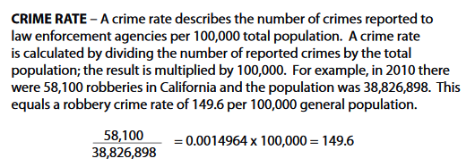

# Comparing Crime Rates, Population, & Hotel Ratings

Is there any correlation between crime, population, and hotel rating?  

## Table of Contents 
* [Team Name](#Team_Info)   
* [Overview](#overview) 
* [Datasets](#Datasets) 
* [Tasks](#tasks)
* [Technologies](#technologies) 
* [Setup](#setup)  
* [Summary](#summary)  
* [Analysis](#analysis)  

## Team Name: Project Won
## Members:
Meghan Luoma, Kirby Miller, Sara Riggs, Alicia Perez, and Kerry Wehner  

## GitHub URL: 
https://github.com/meghanvl/project_won.git

## Overview 
This project was inspired by future travel plans in which we might visit one of these cities.

The purpose of this project is to determine if there is a correlation between crime and hotel ratings in Kansas City, MO; New Orleans, LA; Dallas, TX; Portland, OR; Charlottesville, VA; Chicago, IL; Denver, CO; Sioux Falls, SD; Las Vegas, NV; San Francisco, CA; Chattanooga, TN; and Boston, MA in 2019.  

Question 1: Is there any correlation between average hotel rating and crime rate? 
Question 2: Is there any correlation between a city's population and crime rate? 
Question 3: Is there any correlation between a city's population and average hotel rating?  

Hypothesis: Cities with greater populations will have higher crime rates than cities with smaller populations, and cities with higher crime rates will have lower average hotel ratings.

## Datasets: 
* [City Coordinates](https://latitudelongitude.org/us/)  
* [Charlottesville, VA Coordinates](https://www.lat-long.com/Latitude-Longitude-1498463-Virginia-Charlottesville.html)  
* [FBI Crime Data Explorer API](https://crime-data-explorer.fr.cloud.gov/api)  
* [ORI Lookup Table (provided by: ICPSR)](https://www.icpsr.umich.edu/files/NACJD/ORIs/STATESoris.html)  
* [Crime Rate Calculation](https://oag.ca.gov/sites/all/files/agweb/pdfs/cjsc/prof10/formulas.pdf)
* [Population Data](https://github.com/CommerceDataService/census-wrapper)  
* [Population Labels](https://gist.github.com/afhaque/60558290d6efd892351c4b64e5c01e9b)  
* [Hotel Reviews Using Google Places Library](https://developers.google.com/maps/documentation/javascript/places)  

## Tasks
Alicia - Crime Data API w/Jupyter notebook, Calculations for population & crime w/Jupyter Notebook 
Sara - Powerpoint, API assist, and Jupyter notebook cleanup  
Kirby - Google Places API, Latitude & Longitude Search, Police Location List 
Kerry - Population Data Pull and Jupyter notebook 
Meghan - Hotel API, matplotlib, visualizations, and linear regression  

## Technologies
Project is created with:  
* Pandas 1.0.5  
* Jupyter Notebook 4.6.3  
* Matplotlib 3.3.2  

## Setup
To run the code, open it with jupyter Notebook.
For running the jupyter notebook files the following is required:
* Pip install of gmaps  
* Pip install of citypy  
* Census Key   
* Google Key  
* Crime Data Key (please see the Crime Data API website listed above)

## Summary
We chose select cities across the U.S. that had both similar and dissimilar populations.

To get city data like police department location and hotel ratings in those cities, we needed to get Latitude and Longitude for our subsequent searches.
We used the websites (https://latitudelongitude.org/us, lat-long.com for Charlottesville) to compile a list of coordinates.
Then we pulled a list of Police stations using Google Places API. within 8000 meters of the website's city lat-long coordinates.
Then put the police station lat-long into a csv for use later.
We had to use multiple websites for the list of lat and longs as the first wasn't complete and didn't include Charlottesville.
Interestingly our Kansas City lat and long pulled a Roeland Park Police Station, so we adjusted that lat and long in our later searches.

Initially we investigated several data sources for the crime data. However, we could not get a key for the crimeometer website, so that was scrapped. The FBI Crime Data Explorer required an ORI (Originating Agency Identifier) to pull data. That information was difficult to find from their resources. We attempted to use data from the police station databases directly. However, that was proving to be more cumbersome as each different police station had their data set up differently. The FBI information was uniform for all the agencies, so we went looking for another information source to find the ORI. Once we found that, we went back to the FBI Crime Data Explorer and used that as our data source. 

In order to gather crime data, the ORI (Originating Agency Identifier) was required by the Crime Data Explorer API to get information on specific agencies. An ORI Lookup Table provided by ICPSR (a research data archive) was used to find the ORI for each agency.
https://www.icpsr.umich.edu/files/NACJD/ORIs/STATESoris.html

The crime categories pulled from the FBI were:
aggravated assault, arson, auto theft, burglary, homicide, larceny, property crime, robbery, sex crimes, and violent crime.   
Please see the jupyter notebook "Crime_Stats_ORI" for more information regarding those categories. 

All the crime stats were gathered using the FBI's Crime Data Explorer API. We chose to pull only the 2019 data from the FBI website. 
https://crime-data-explorer.fr.cloud.gov/api

From the API we pulled each category of crime available for every agency's ORI. From the requests we made a dataframe of all the data. Totals were added to the dataframes. 
We did three totals for crimes rates. The three categories are total crime, total person crime, and total property crime. Total crime includes all categories. Total person crime includes aggravated assault, homicide, robbery, sex crimes, and violent crime. Total property crime includes arson, auto theft, burglary, larceny, and property crime. 
Each agency had a separate dataframe made as well as a combined dataframe. All were exported to csv files. 

To research the population, we created a jupyter notebook and used our census API key.
We did have some trouble with our API key because the census did not have the 2019 data we wanted, which of course we had to spend hours trying to figure out what was happening. So, we then turned to the next best thing, using another year. We used 2018 for our population data.
And to find the population for each city also took some tinkering. To start we were only finding state populations, then county, then the wrong cities. But once we outsmarted jupyter notebook we created a dataframe for each of our 12 cities.
C.asc5.state_place
And looked up corresponding numbers for each city
In the end we merged all the dataframes together to create one chart with all the information we needed and exported into a csv to be used in our other data analyzation.

Once the population was found, the crime data was merged with the population in order to create the crime rates. The crime rate was calculated by taking the crime total divided by the population and multiplying by 100,000.  

The crime rate was calculated in the jupyter notebook "PD_Pop_Crime_Rates" for each crime individually and by the 3 total groups. Several dataframes were made and exported to csv files, so that a variety of data could be pulled.

To get hotel and hotel rating data we sent an API request to Google Places and used the nearby search to locate hotels within 8,000 meters of our 12 cities latitude and longitude. We spent quite a bit of time researching an API source for hotels with hotel ratings and ultimately decided Google Places provided what we needed. Once we had the data, we created a dataframe to display the results, added a column for state and used the insert method to add the state abbreviation. We then calculated the average hotel rating for each hotel, created a new dataframe and output it to a csv file. 
We brought in that csv file and the crime csv file, which includes data for total crimes, total crime rates, total property crime rates, and total person crimes for each city to a new jupyter notebook and merged them on state. We created a map with info box for each city and the corresponding average hotel rating and a map with info box for each city, the city’s population, and the city’s total crime. We also created visualizations including bar charts and linear regressions so we could check for a correlation between crimes and ratings, and population and ratings.

## Analysis   
### Question 1:   
Is there any correlation between average hotel rating and crime rate? 
There is a weak correlation between average hotel rating and crime rate when using overall crime rate (r value is 0.12). When breaking down the crime rate to person and property crime rates, there are some differences. With property crime rate, the r value is 0.15 another weak correlation. The person crime rate compared to average hotel rating has an r value of 0.002 making correlation non-existent. Average hotel rating could be affected by property crime rates.

### Question 2:    
Is there any correlation between a city's population and crime rate? 
The r value for total crime rate and city population is 0.02 which means correlation doesn't exist. However, when looking at the total crime occurrences and population, there is an r value of 0.87 which is a very strong correlation. This should not be surprising as more people means higher chance of crime.

One interesting thing to note is between the cities of Boston and Charlottesville. Boston is more than ten times the size of Charlottesville, and so their total crime occurrences are vastly different. However, their crime rates are roughly the same. 

### Question 3:   
Is there any correlation between a city's population and average hotel rating?  
The r value for city's population and average hotel rating is 0.03 making another non-existent correlation. 

### Hypothesis:  
For our overall hypothesis, there is not strong correlation to suggest that crime rate has an effect on average hotel rating, nor is there a strong correlation between crime rate and population. Our findings are not enough to influence any future travel plans. 

### Future Research:  
* We would narrow our searches to neighborhoods instead of overall city data.   
* We would include more hotels and categorize by hotel types (ex. star rating).  
* We would also investigate more cities. 
* Another question we would ask of the data, what time of year has the highest crime rate?